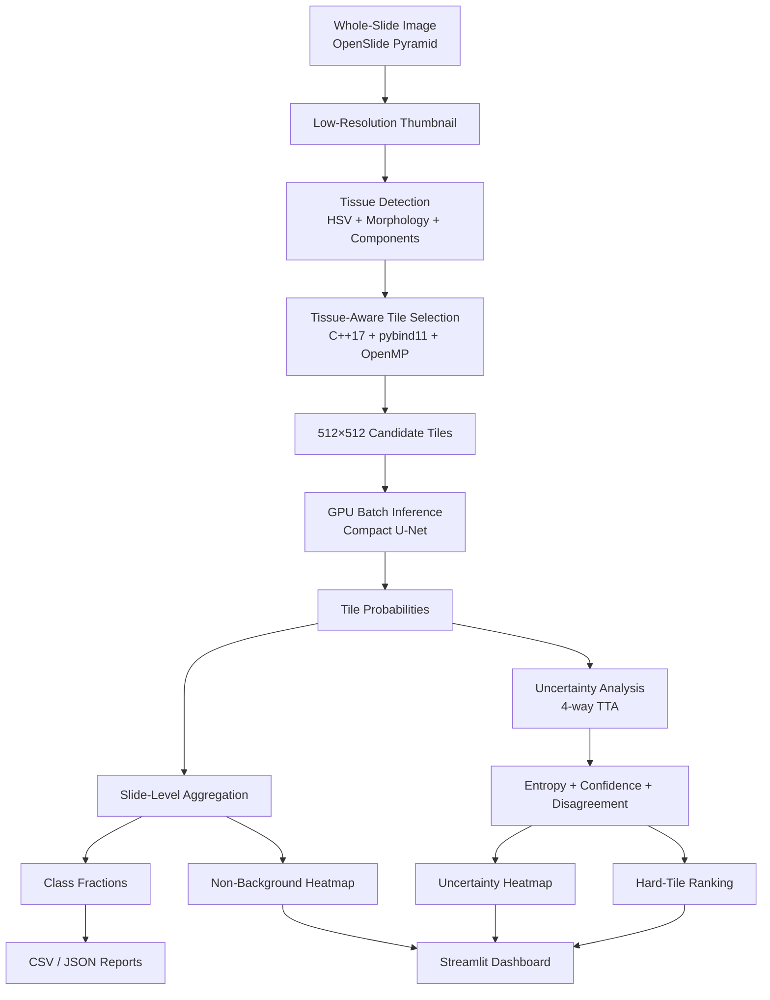

# PathoX — Gigapixel Digital Pathology AI Engine

> **From a whole-slide image to an uncertainty-aware, accelerated, deployable segmentation pipeline.**

PathoX is a systems-oriented digital pathology engine for **whole-slide image (WSI) analysis**. It treats a pathology slide as a spatial computing problem rather than a single image: read the multi-resolution pyramid, locate tissue at low resolution, map that information back to level-0 coordinates, avoid background computation, run GPU segmentation only where needed, quantify the slide, and surface the most uncertain regions for inspection.

The implementation combines **Python orchestration + PyTorch deep learning + C++17/pybind11/OpenMP acceleration + OpenSlide WSI I/O + Streamlit + Docker/NVIDIA GPU deployment**.

---

## At a Glance

| Capability | Result / Design |
|---|---|
| WSI access | OpenSlide pyramid-aware region reads |
| Tile processing | Configurable, validated **512×512** tiles |
| Tissue screening | HSV + morphology + connected components |
| Native acceleration | C++17 + pybind11 + OpenMP |
| Native tissue-selection speedup | **10.91×** vs Python reference |
| Segmentation model | Compact **6-class U-Net** |
| Model blocks | GroupNorm + GELU + skip connections |
| Training strategy | Dice + Cross-Entropy + inverse-square-root class-balanced sampling |
| Uncertainty | 4-way TTA + entropy + confidence + disagreement |
| Real-data experiment | **24 Radboud PANDA slides / 786 tiles** |
| Validation | **195 tiles** |
| Validation Dice / IoU | **0.5093 / 0.4379** |
| End-to-end WSI benchmark | **10.54 s / 184 tiles / 17.46 tiles/s** in Docker |
| Automated tests | **39 passed** |
| Deployment | Docker + NVIDIA GPU + Streamlit |

> The quantitative results are from a deliberately small PANDA Radboud subset and are presented as an engineering/research benchmark, **not clinical validation**.

---

## Why PathoX?

Whole-slide pathology data is fundamentally different from ordinary computer-vision inputs.

A WSI can contain enormous pixel dimensions, large areas of background, multiple image-pyramid levels, spatially correlated tiles, and expensive downstream inference. Processing every possible full-resolution patch is wasteful.

PathoX therefore separates the problem into **cheap spatial filtering first, expensive AI computation second**:

1. **Read the WSI pyramid without loading the complete slide into RAM.**
2. **Create a thumbnail-level tissue mask.**
3. **Map thumbnail coordinates to level-0 WSI coordinates.**
4. **Use native C++/OpenMP to score tissue coverage and select candidate tiles.**
5. **Run batched GPU segmentation only on selected regions.**
6. **Apply TTA to the highest-priority uncertain tiles.**
7. **Aggregate tile predictions into slide-level measurements and heatmaps.**

That design is the core engineering idea behind PathoX.

---

## Architecture



---

## Core Engineering Workflow

### 1. Pyramid-aware WSI I/O

`WSIReader` wraps OpenSlide and exposes:

- WSI metadata
- pyramid level dimensions
- level downsample factors
- MPP metadata when available
- safe RGB region reads
- thumbnail generation
- resource cleanup

Coordinates remain anchored to **level 0**, while reads can be performed at a selected pyramid level.

This makes it possible to work with very large slides using localized reads instead of materializing an entire WSI in memory.

### 2. Tissue-first filtering

PathoX detects tissue on a low-resolution thumbnail using:

- RGB → HSV conversion
- saturation/value thresholds
- morphological opening and closing
- small connected-component removal

The resulting binary tissue mask is then reused for tile candidate selection.

The important idea is simple:

> **Do not spend GPU compute on obvious background.**

### 3. Coordinate-aware candidate selection

A candidate tile is not judged by looking at its full-resolution pixels.

Instead, the WSI tile coordinates are projected into the thumbnail mask:

```text
level-0 tile
     ↓
WSI → thumbnail coordinate mapping
     ↓
thumbnail tissue region
     ↓
tissue fraction
     ↓
candidate / reject
```

The native implementation reproduces the Python reference mapping and validates its outputs against it.

### 4. Native C++ / OpenMP acceleration

The repeated tile-scoring loop is implemented in C++17 and exposed to Python through pybind11.

OpenMP parallelizes independent tile computations.

The native module contains:

- `score_tiles(...)`
- `score_tissue_tiles(...)`
- `max_threads()`

The Python implementation remains the reference/fallback path, so the optimization does not become a hard dependency for the higher-level inference code.

### 5. GPU segmentation

Candidate tiles are processed in batches with PyTorch.

The segmentation network is a compact U-Net using:

- convolutional feature extraction
- GroupNorm
- GELU
- four downsampling stages
- four upsampling stages
- skip connections
- a 1×1 classification head
- six output classes for the Radboud experiment

The compact architecture keeps the full pipeline practical on a **6 GB laptop GPU**.

### 6. Class-aware training

The real-data experiment uses deterministic **slide-level splitting** so tiles from the same slide do not cross train/validation boundaries.

The training loader uses **inverse-square-root class-frequency sampling** to reduce the dominance of common target classes while avoiding extremely aggressive oversampling.

### 7. Uncertainty-aware inference

For selected difficult tiles, PathoX evaluates four transformed inputs:

- original
- horizontal flip
- vertical flip
- horizontal + vertical flip

Predictions are transformed back to the original orientation and averaged.

From the resulting probabilities, PathoX computes:

- normalized predictive entropy
- mean confidence
- TTA disagreement
- hard-tile rankings

This gives the pipeline a second output beyond segmentation:

> **Where is the model uncertain?**

### 8. Whole-slide aggregation

Tile outputs are converted into slide-level artifacts:

- per-tile CSV predictions
- class fractions
- predicted non-background fraction
- confidence statistics
- uncertainty statistics
- spatial heatmaps
- hard-tile tables
- JSON slide report
- optional hard-tile image crops

---

## Technology Stack

| Layer | Technologies |
|---|---|
| Languages | **Python, C++17** |
| Deep Learning | **PyTorch** |
| WSI | **OpenSlide** |
| Computer Vision | **OpenCV, scikit-image** |
| Numerical | **NumPy, Pandas, SciPy** |
| Native acceleration | **OpenMP, pybind11, CMake** |
| Uncertainty | **TTA, entropy, confidence, disagreement** |
| UI | **Streamlit** |
| Deployment | **Docker, Docker Compose, NVIDIA GPU** |
| Testing | **pytest** |

---

## Repository Layout

```text
PathoX/
├── app/
│   └── pathox_dashboard.py
│
├── cpp/
│   └── pathox_native/
│       ├── CMakeLists.txt
│       └── bindings.cpp
│
├── src/pathox/
│   ├── core/
│   │   ├── wsi.py
│   │   ├── tile.py
│   │   ├── tissue.py
│   │   ├── tissue_filter.py
│   │   └── stain.py
│   │
│   ├── datasets/
│   │   ├── panda.py
│   │   ├── split.py
│   │   ├── panda_segmentation.py
│   │   └── segmentation_dataset.py
│   │
│   ├── inference/
│   │   ├── slide_engine.py
│   │   └── uncertainty.py
│   │
│   ├── models/
│   │   ├── unet.py
│   │   └── losses.py
│   │
│   └── training/
│       └── engine.py
│
├── scripts/
│   ├── train_real_panda.py
│   ├── train_real_panda_weighted.py
│   ├── evaluate_panda_model.py
│   ├── run_slide_inference.py
│   ├── uncertainty_hard_tiles.py
│   ├── benchmark_cpp_acceleration.py
│   ├── benchmark_slide_candidate_selection.py
│   └── benchmark_end_to_end.py
│
├── Dockerfile
├── docker-compose.yml
├── requirements.txt
├── pyproject.toml
└── README.md
```

---

## Real-Data Experiment

PathoX was tested on a small real subset of the [PANDA prostate cancer grading dataset](https://www.kaggle.com/c/prostate-cancer-grade-assessment), using Radboud slides with six segmentation classes:

| Class ID | Meaning |
|---:|---|
| 0 | Background |
| 1 | Stroma |
| 2 | Benign epithelium |
| 3 | Gleason 3 |
| 4 | Gleason 4 |
| 5 | Gleason 5 |

### Dataset used in this repository

```text
Radboud slides       : 24
Train slides         : 18
Validation slides    : 6

Training tiles       : 591
Validation tiles     : 195
Total extracted      : 786

Tile size            : 512 × 512
Classes              : 6
```

The split is performed at the **slide level**, not the tile level, to reduce information leakage from highly correlated tiles originating from the same WSI.

Raw WSIs, masks, checkpoints, and generated outputs are intentionally excluded from Git.

---

## Segmentation Results

Current class-balanced sampling experiment:

```text
Validation tiles : 195

Mean Dice : 0.5093
Mean IoU  : 0.4379
```

The experiment demonstrates a functioning real-data segmentation pipeline, but class performance is uneven, especially for rare classes.

These numbers should **not** be interpreted as full-dataset PANDA performance, external validation, or clinical diagnostic accuracy.

---

## Performance Engineering

### Python vs C++/OpenMP tile scoring

The native implementation was compared with the Python reference on a real segmentation mask:

```text
Python candidates : 1491
C++ candidates    : 1491

Python time       : 0.9388 s
C++/OpenMP time   : 0.0892 s

Speedup           : 10.53×
Candidate output  : MATCH
```

### Tissue-aware WSI candidate selection

A second benchmark validates the optimization on a real WSI:

```text
Python mean       : 0.003388 s
Native mean       : 0.000311 s

Speedup           : 10.91×

Coordinate match  : True
Max fraction error: 3×10⁻⁸
```

This is not a theoretical optimization claim: the benchmark checks **both correctness and execution time**.

---

## End-to-End WSI Benchmark

The complete inference benchmark includes:

- WSI I/O
- thumbnail generation
- tissue screening
- candidate selection
- tile extraction
- preprocessing
- GPU segmentation
- uncertainty processing
- output generation

Benchmark configuration:

```text
GPU                 : NVIDIA GeForce RTX 3050 6GB Laptop GPU
Tile size           : 512 × 512
Stride              : 512
Thumbnail           : 2048
Tissue threshold    : 0.12
Batch size          : 4
Uncertainty top-k   : 50
Warmup              : 1
Timed runs          : 3
```

### Containerized benchmark result

```text
Mean end-to-end time : 10.5379 s
Std deviation        : 0.0769 s
Tiles analyzed       : 184
Throughput           : 17.46 tiles/s

Tissue fraction      : 0.1840
Predicted non-bg     : 0.8327
Mean confidence      : 0.7843
Mean entropy         : 0.3698
TTA disagreement     : 0.0063
```

The throughput is a **full-pipeline measurement**, not a raw neural-network FPS number.

A native WSL run of the same benchmark measured approximately **10.42 s / 17.66 tiles/s**, showing similar end-to-end behavior before containerization overhead.

---

## Reliability and Testing

PathoX includes automated tests for:

- WSI metadata and region handling
- tile extraction
- tissue detection
- tissue-aware filtering
- stain normalization
- PANDA dataset utilities
- slide-level splitting
- segmentation components
- uncertainty computation
- native C++ integration
- native tissue scoring
- inference behavior

Current verification:

```text
39 passed
```

Additional benchmarks explicitly check native/Python candidate equivalence before reporting speedups.

---

## Dashboard

PathoX includes a Streamlit interface for interactive inference.

Launch:

```bash
streamlit run app/pathox_dashboard.py
```

Then open:

```text
http://localhost:8501
```

The dashboard exposes:

- WSI path
- checkpoint path
- tile size
- tissue threshold
- uncertainty top-k
- slide summary metrics
- class distribution
- WSI overview
- predicted non-background heatmap
- uncertainty heatmap
- highest-uncertainty regions
- raw JSON report

---

## Docker / GPU Deployment

The repository includes a reproducible container build.

Build:

```bash
docker compose build
```

Run:

```bash
docker compose up -d
```

Open:

```text
http://localhost:8501
```

The Compose configuration requests NVIDIA GPU access and mounts the external pathology data read-only.

The Dockerfile also compiles the C++/OpenMP extension during image creation, so the container contains the same native acceleration layer as the development environment.

---

## Reproducing the Main Checks

### Development environment

```bash
cd ~/PathoX
source .venv/bin/activate
```

### Run tests

```bash
pytest -q
```

### Run a real WSI

```bash
python scripts/run_slide_inference.py
```

### Run the end-to-end benchmark

```bash
python scripts/benchmark_end_to_end.py
```

### Evaluate a checkpoint

```bash
python scripts/evaluate_panda_model.py \
  --checkpoint /mnt/d/PathoXData/experiments/panda/pathox_panda_sampler_best.pt
```

---

## Engineering Decisions That Matter

### Why thumbnail-first?

A low-resolution tissue mask is dramatically cheaper than reading every full-resolution tile solely to determine whether that tile contains tissue.

### Why slide-level splitting?

WSI tiles are highly correlated. Splitting individual tiles can leak slide-specific appearance into validation.

### Why C++/OpenMP?

Candidate scoring is repetitive, embarrassingly parallel work dominated by tight loops over mask pixels. It is a natural fit for native code and OpenMP.

### Why keep a Python fallback?

Optimization should not destroy portability. The high-level engine can fall back to the Python implementation when the native extension is unavailable.

### Why TTA?

Instead of producing only a hard prediction, PathoX also estimates prediction stability across spatial transformations.

### Why separate inference from aggregation?

Tile-level inference is a local operation; pathology analysis also needs a spatially coherent slide-level representation. PathoX keeps these responsibilities explicit.

---

## Data and Artifact Policy

Large or generated artifacts are intentionally outside version control.

Ignored:

```text
Raw WSIs
Segmentation masks
Trained checkpoints
Generated outputs
Virtual environments
Native build artifacts
```

Tracked:

```text
Python source
C++ source
Tests
Training / evaluation scripts
Inference scripts
Docker configuration
Project metadata
Documentation
```

This keeps the Git repository lightweight while preserving the complete engineering pipeline.

---

## Limitations

PathoX is an **engineering/research prototype**.

The current quantitative experiment is intentionally small:

- 24 Radboud slides
- 786 extracted tiles
- 195 validation tiles
- six segmentation classes

Rare classes remain difficult, and the current dataset is not sufficient for claims about generalization across the full PANDA dataset, institutions, scanners, or clinical settings.

The current system should therefore be treated as a demonstration of:

**WSI systems engineering + computer vision + segmentation + acceleration + uncertainty + deployment**

rather than as clinically validated diagnostic software.

---

## Roadmap

The architecture is intentionally extensible toward:

- larger-scale PANDA training
- stronger segmentation backbones
- multi-scale WSI inference
- asynchronous CPU/GPU pipelines
- richer stain augmentation
- CUDA kernels for additional preprocessing
- ONNX / TensorRT inference
- model calibration
- external-dataset evaluation
- patch-level lesion detection
- slide-level cancer classification
- distributed WSI processing
- richer ROI exploration

---

## The Technical Story

PathoX is not just a U-Net trained on image patches.

It is a complete pipeline for turning a very large pathology slide into structured, spatially meaningful AI outputs:

```text
                 RAW WSI
                    │
                    ▼
          Pyramid-aware access
                    │
                    ▼
          Tissue-first filtering
                    │
                    ▼
       Native C++ / OpenMP scanning
                    │
                    ▼
             GPU segmentation
                    │
                    ▼
         Uncertainty-aware TTA
                    │
                    ▼
          Whole-slide aggregation
                    │
          ┌─────────┼─────────┐
          ▼         ▼         ▼
        Metrics   Heatmaps   Reports
                              │
                              ▼
                         Streamlit
```

That combination is the point of PathoX:

> **Use the right abstraction at each stage — image pyramid for scale, low-resolution masks for search, native code for tight loops, GPU compute for neural inference, uncertainty for model introspection, and slide-level aggregation for meaningful output.**

---

## Release

Current repository baseline:

```text
Package version : 0.1.0
Release tag     : v0.1.0
```

The project was validated end-to-end with:

- ✓ Real PANDA WSI data
- ✓ Native C++ / OpenMP acceleration
- ✓ CUDA GPU inference
- ✓ Uncertainty-aware inference
- ✓ Streamlit dashboard
- ✓ Docker GPU deployment
- ✓ 39 automated tests

---

## Author

**Hetram Gugrwal**

Built as a systems-oriented computer-vision project combining digital pathology,
deep learning, C++ optimization, GPU inference, uncertainty estimation,
and deployable software engineering.
